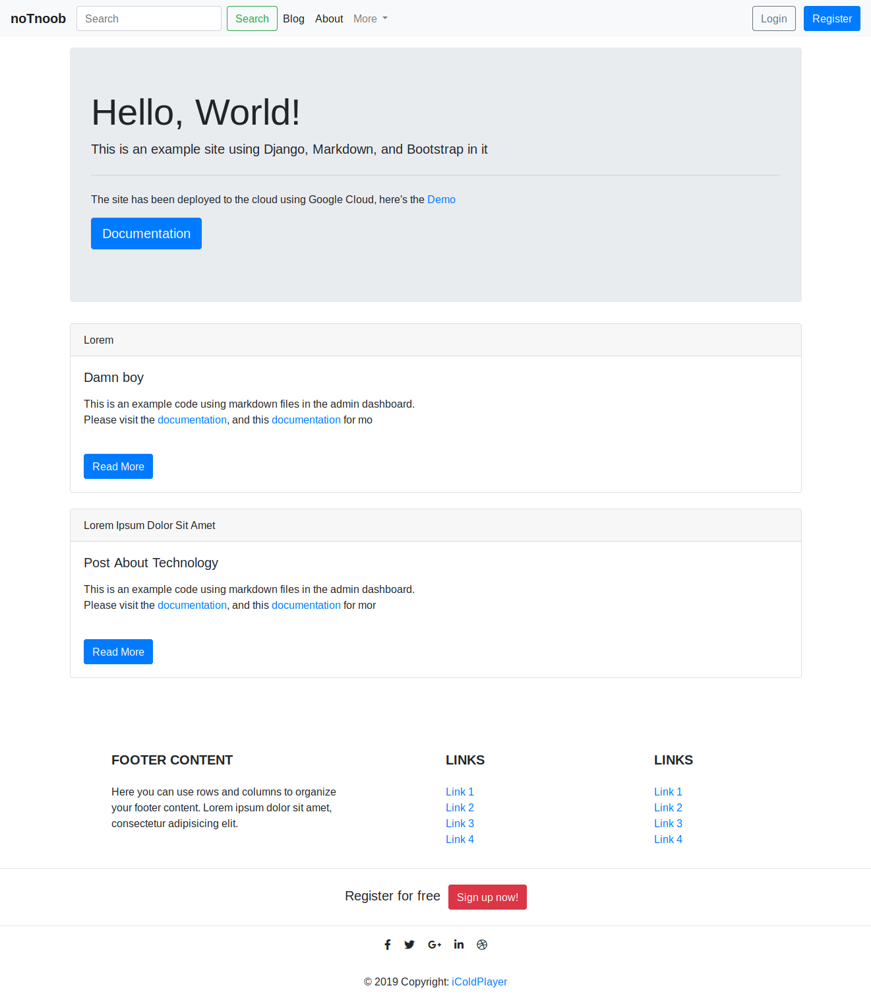
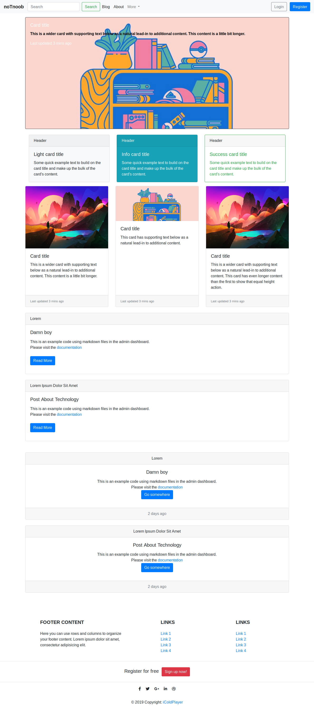

## Blog using Django

This made with [Django2.2](https://docs.djangoproject.com), [bootstrap](getbootstrap.com), and [markdown](https://www.markdownguide.org/).

#### See the [Installation](/usage.md) detail.


#### Screenshot

----------
#### Homepage




<br>

#### Blog Page



#### Usage 

Run the project locally
```
# clone it
git clone https://github.com/iColdPlayer/django-blog.git

# move to blog dir
cd django-blog

# activate the virtual environment or you can create yourself
source env/bin/activate

# install all the dependencies
pip install -r requirements.txt

# run the project locally
./manage.py runserver

```

default password & user are `admin`.

**Note**:
- [Github Markdown Tutorials](https://github.com/adam-p/markdown-here/wiki/Markdown-Cheatsheet), [Documentation 1](https://github.com/markedjs/marked), [Documentations 2](https://github.com/agusmakmun/django-markdown-editor)
- [Django Tutorials](https://docs.djangoproject.com)
-------------------

Copyright : [iColdPlayer](https://dev.notnoob.com)
