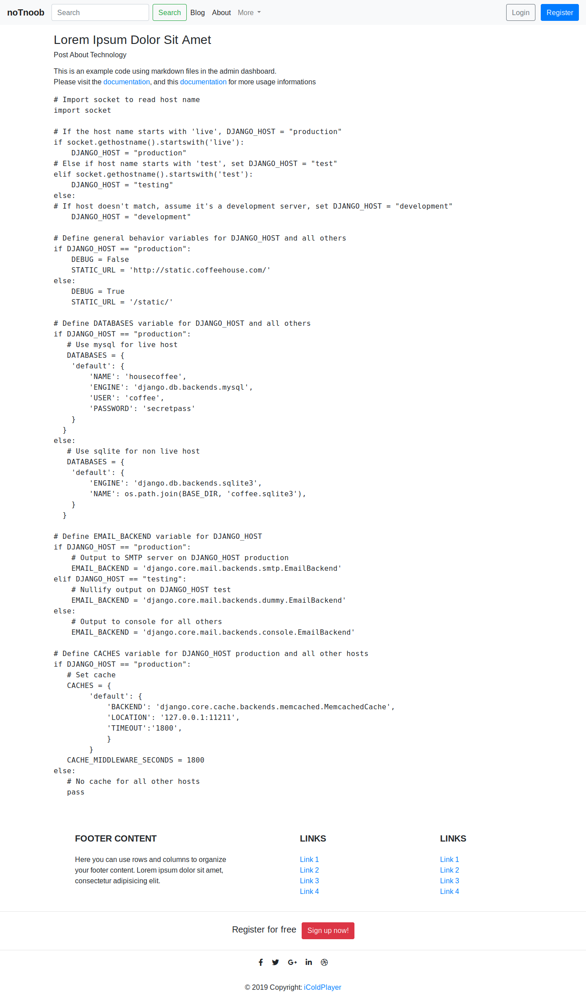
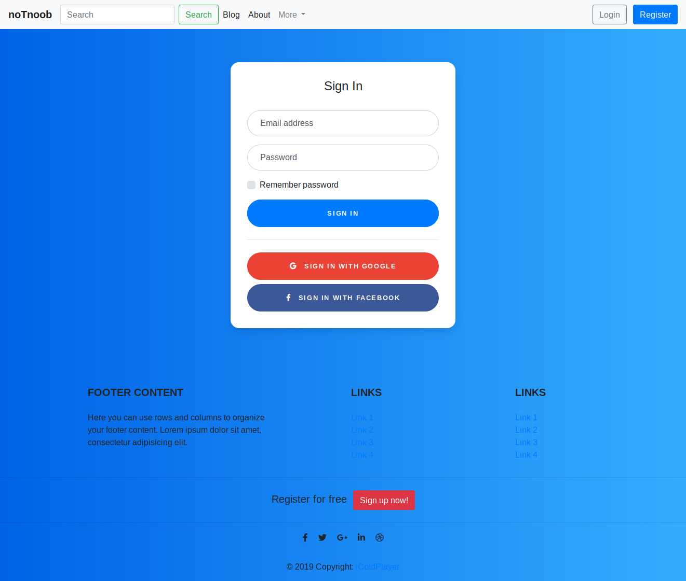
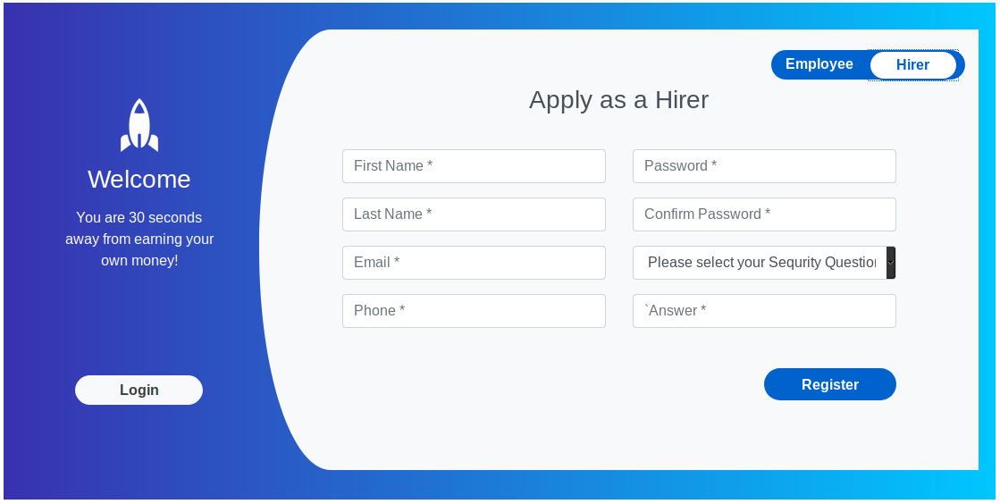
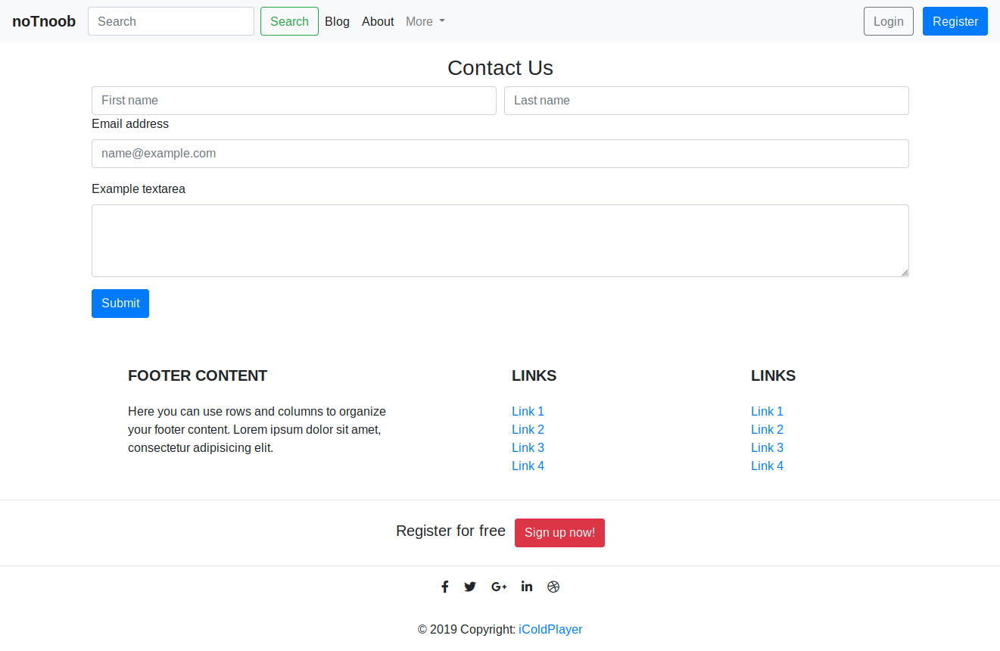

## Django Project 

#### For Public Distribution

This made with [Django2.2](https://docs.djangoproject.com) and bootstrap.


#### Screenshot

----------
#### Homepage


<br>

#### Blog Page


<br>

#### Blog Page


<br>

#### Login Page


<br>

#### Register as employee


<br>

#### Register as hirer



<br>

#### Contact Us


<br>

#### Dependencies:
Packages:
```
Package    Version 
---------- --------
certifi    2019.3.9
chardet    3.0.4   
Django     2.2.1   
idna       2.8     
Markdown   3.1     
martor     1.4.0   
pip        19.1.1  
pytz       2019.1  
requests   2.21.0  
setuptools 39.0.1  
sqlparse   0.3.0   
urllib3    1.24.3  
```
Styling:
```
Bootstrap 4.*
JavaScript
Font Awesome 4.*
```

Support:
- Markdown on admin interface
- Login Page (on development)
- Register Page (on development)
- Accounts Page (on development)

Please feel free to fork or clone to your own repository and pull request or open an issue.


#### Usage 
- Clone this repo using `git` to your local machine. <br>
`git clone https://github.com/iColdPlayer/DjangoProjects.git your-folder-name`
- since the dependencies are in virtual environment, 
you need to activate it first from `env` folder. Now go to `your-filder-name` and type:<br>
    - `./manage.py runserver` or `python manage.py runserver`
- I've added *usename*: `admin`, and the *password* `admin` by default.
- Or, you can create your own username:
    - `./manage.py createsuperuser` and enter your additional informations and login from `lodalhost:8000/admin`.
- And you're ready to go. Please feel free to open an issue or pull request.


#### And what's next?.
- Handle request from login page.
- Handle registration forms.
- User management in `accounts` apps.
- Push message from contact to our email.
- Inserting Disqus comments for each posts.
- Deploy on Google App Engine (Flexible Environment). Already deployed. See the demo [here](https://notnoob.com).
- Users direct messages.

-------------------

Copyright : [iColdPlayer](https://dev.notnoob.com)